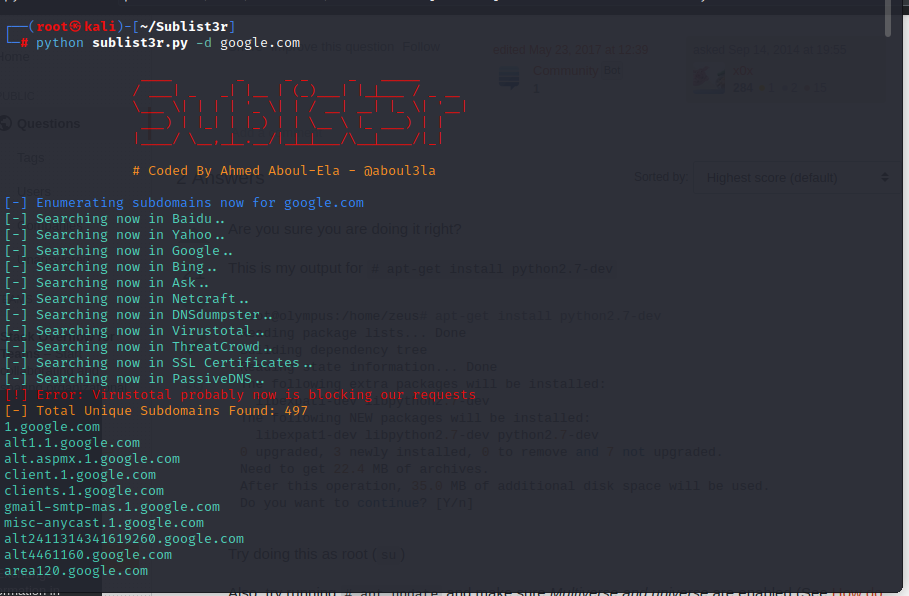

# Kali_tools

<h2>Практические навыки работы с Kali Linux</h2>
На основе операционной системы Kali Linux были разобраны основные
инструменты для проведения тестирований на проникновение. Попробуем найти
какие-либо данные с помощью его инструментов. Kali имеет широкий спектр
программ для сканирования хостов на наличие открытых портов и анализ
уязвимостей веб-серверов.

<h4> Nmap— утилита, предназначенная для сканирования IP-сетей,
определения состояния объектов сканируемой сети (портов и соответствующих
им служб). </h4>

Первым делом просканируем специальный хост на наличие открытых
портов.  

 
Рисунок Сканирование хоста scanme.nmap.org  

Анализируем полученные данные:

1. Разберемся с состояниями (STATE)  
   Nmap распознаёт следующие состояния портов: open, filtered, closed,
   или unfiltered. Open - готово для принятия пакетов на этот порт. Filtered -
   брандмауэр, фильтр, или что-то другое в сети блокирует порт, так что Nmap не
   может определить, является ли порт открытым или закрытым. Closed — не
   связанны в данный момент ни с каким приложением, но могут быть открыты в
   любой момент. Unfiltered порты отвечают на запросы Nmap, но нельзя
   определить, являются ли они открытыми или закрытыми.

3. Service и port
   Стандартные сервисы находятся на своих стандартных портах:  
   FTP — протокол передачи файлов по сети.  
   SSH — сетевой протокол прикладного уровня, позволяющий производить
   удалённое управление операционной системой и туннелирование TCP-
   соединений. 
   HTTP - протокол прикладного уровня передачи данных. 
   И пару нестандартных соединений: 
   Nping — это инструмент с открытым исходным кодом для генерации сетевых
   пакетов, анализа ответов и измерения времени отклика. 
   1331337 - Этот номер порта означает «элитный» в написании взломщика (3=E, 1=L,
   7=T) и из-за особого значения часто используется для целей злоумышленников.
   На этом порту работает много бэкдоров/троянов, вот некоторые другие, которые
   работают на том же порту: Back Orifice, Elite. 
   Таким образом, мы нашли бэкдор. 

<h4>Nikto – это инструмент оценки веб-серверов.</h4>
Он предназначен для поиска различных небезопасных файлов, конфигураций и программ на веб-серверах
любого типа. Результат работы сканера показан на рисунке. 

 
Рисунок – Вывод команды от сканера Nikto.  
Этой командой мы сразу получаем особенности структуры сайта,
благодаря информации о заголовках и сервере. Стоит отметить, что Nikto имеет
широкий функционал и способен частично или полностью заменять другие
инструменты. Так, например, он также выдает информацию о протоколах
шифрования SSL, таким образом мы можем не прибегать без необходимости к
Wireshark9-у.

<h4>Sublister — это инструмент, разработанный на Python для поиска
поддоменов веб-сайта с использованием OSINT</h4>
Для начала разберемся с основными понятиями. Название сайта
соотнесенное по DNS с IP-адресом н азывается доменом. Поддомен же нужен
для продвижения сайтов и развлетвления тяжелой структуры сайта. В пентесте
необходим поиск поддоменов для тестирования на безопасность, ведь поддомен
может оказаться слабо защищенным.
Попробуем найти поддомены google.com. Для этого воспользуемся
программой для поисков поддоменов Sublist3r (см. рисунок).  
 
 
Рисунок –Найденные поддомены сайта google.com.